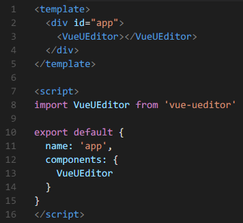
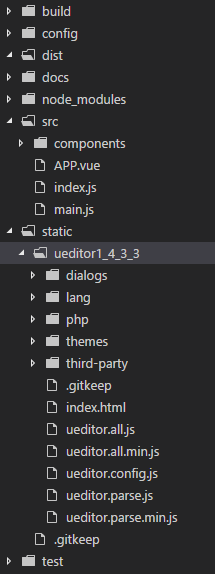
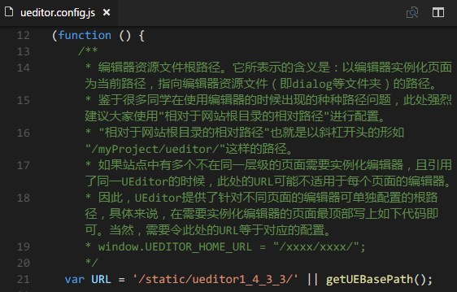
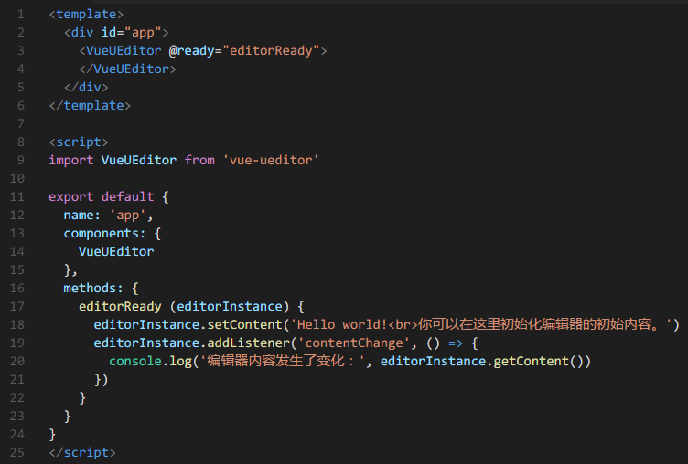
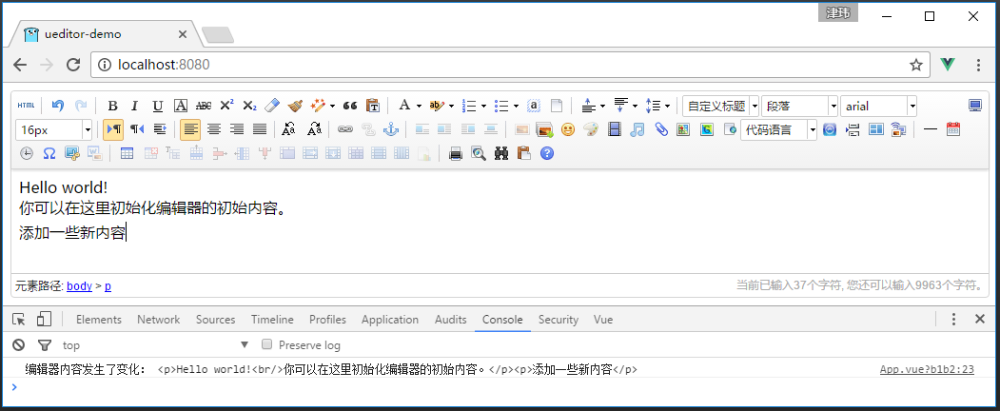
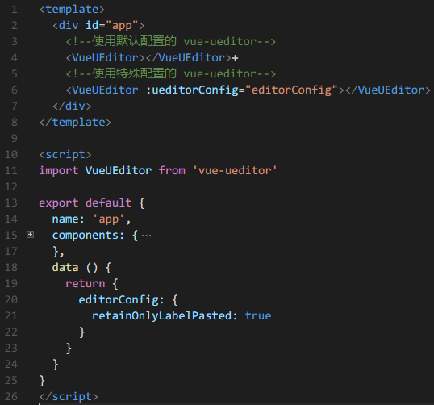

# vue-ueditor
a wrapper of UEditor for vue 2.x


## Description
[UEditor](http://ueditor.baidu.com/website/index.html) 是功能齐全、质量稳定、文档完善的富文本编辑器，可惜它并不能很好的在基于 Vue 的前端项目中使用。于是我写了这个包装组件，使得在基于 Vue 的前端项目中也能很方便的使用 ueditor

## Install
``` npm i vue-ueditor --S ```

（推荐你用 [cnpm](https://npm.taobao.org)，这会让你的 npm 包安装速度大幅提升）

## Setup

首先，在需要使用 UEditor 的页面引入 UEditor, 并将其添加到 template

 

然后，你需要下载一份完整的 UEditor 代码包放到项目中的某个目录



比如这里我们把 UEditor 代码包放到了 static 目录，如果你是用 vue-cli 初始化项目结构的，那么我推荐你也和我一样把 UEditor 放在 static 目录。如果你想放在别的目录，也可以，但是，一定要记得给 vue-ueditor 设置正确的路径。


最后，修改 UEditor 代码中的配置文件，设置 UEditor 的根路径



同样，这里的 URL 也最好是绝对路径。如果这里填写的是相对路径，当你在项目的不同目录下的不同页面中使用 UEditor 的时候则很可能会出错。

值得注意的是，上面设置的那些路径，都必需是在服务器上可以访问到的路径，vue-editor 并不会使 webpack 打包项目时把 UEditor 代码包中的代码也包括进来，所以如果你像上面所说的那要把 UEditor 放到了 static 目录，那么站点必需保证 http://domain.com/static/ueditor1_4_3_3/ 这个路径是可访问的状态。

## Usage
为了开发和使用方便，vue-ueditor 并没有修改或包装 UEditor 的任何功能和接口，而是在编辑器初始化成功的时候，将 UEditor 实例作为 ready 事件的参数传递给使用方，这样你就可以通过这个实例调用 UEditor 的各种功能了。





如果你需要使用 UEditor 的图片上传功能，记得查看 UEditor 的帮助文档，修改相关配置。

有时候，同一个项目中，不同功能对 UEditor 的配置要求是不一样的，这个时候你需要使用 vue-editor 的 ueditorConfig 属性来为某个 vue-editor 实例执行特殊的配置。



这样，第一个 UEditor 编辑器将使用 ueditor.config.js 中的配置，而第二个编辑器将用 editorConfig 中的配置像，覆盖 ueditor.config.js 中的指定配置项目。

最后，提醒一点，如果你在同一个页面中使用了多个编辑器，那么你可能会发现有时候其中的一些编辑器无法正确的被初始化。这时你可以考虑是不是因为你没有正确的使用 key 属性。相关知识请参考 vue 的 API 文档。

## FAQ
最后，如果你在使用过程中发现什么问题，麻烦先去 [这里](https://github.com/SilentTiger/vue-ueditor/issues?q=is%3Aissue+is%3Aclosed) 还有 [这里](https://github.com/SilentTiger/vue-ueditor/pulls?utf8=%E2%9C%93&q=) 瞄一瞄。

## Lisence
MIT
